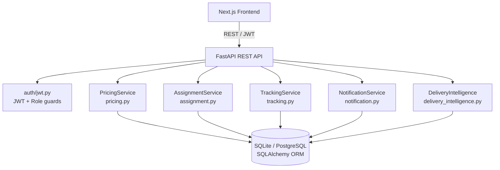

# System Design — Last-Mile Delivery Tracker

## Overview

A role-based delivery management platform (Customer / Agent / Admin) built on FastAPI + SQLite with a Next.js frontend. All business logic lives in dedicated service modules; the API layer only orchestrates them.

---

## Architecture



---

## 1. Rate Calculation Engine (`pricing.py`)

**Inputs:** pickup_area_id, drop_area_id, L×W×H, actual_weight, order_type (B2B/B2C), payment_type (COD/PREPAID)

**Steps:**

1. **Zone detection** — lookup `Area → Zone` via FK relationship. Both pickup and drop zones are resolved from the DB; no hardcoded mapping.
2. **Volumetric weight** = `(L × W × H) / 5000` (industry standard divisor).
3. **Chargeable weight** = `max(actual_weight, volumetric_weight)`.
4. **Rate card lookup** — query `RateCard` where `from_zone_id`, `to_zone_id`, `order_type`, `is_active=True` all match. Intra-zone and inter-zone are distinguished by whether `pickup_zone_id == drop_zone_id`.
5. **Charge** = `base_rate + (chargeable_weight × rate_per_kg)`.
6. **COD surcharge** — applied only if `payment_type == COD`; value comes from the matched rate card row, never hardcoded.
7. **Total** = `base_charge + cod_surcharge`.

All rate values (base_rate, rate_per_kg, cod_surcharge) live exclusively in the `rate_cards` table. No pricing constant is hardcoded in business logic.

---

## 2. Auto-Assignment (`assignment.py`)

**Algorithm:**

1. Query all `DeliveryAgent` records with `availability_status = AVAILABLE`.
2. For each candidate agent, compute a **score** (lower = better):
   - `zone_penalty = 0` if agent's `current_zone_id` matches the order's `pickup_zone_id`; else `100`.
   - `distance = haversine(pickup_coords, agent_coords)` in km if both GPS coordinates exist; else `999` (large fallback).
   - `score = zone_penalty + distance`.
3. Sort by score ascending; assign the best candidate.
4. Mark the agent `BUSY` on assignment; mark `AVAILABLE` on `DELIVERED` or `FAILED`.

**Haversine formula** — great-circle distance using Earth radius = 6371 km:
```
a = sin²(Δlat/2) + cos(lat1)·cos(lat2)·sin²(Δlon/2)
d = 2R·atan2(√a, √(1−a))
```

**Fallback** — if no GPS coords are available for either side, distance = 999, so zone preference alone decides the winner.

---

## 3. Immutable Tracking (`tracking.py`)

All tracking history is **append-only**. This is enforced architecturally:

- `create_tracking_event()` always calls `db.add(new_event)` — never `db.query(...).update(...)`.
- `update_order_status()` atomically: (1) validates the transition, (2) updates `order.status`, (3) calls `create_tracking_event()`. Both changes commit together.
- **No API endpoint** exposes DELETE or UPDATE on `tracking_events`.
- Admin override (`is_admin=True`) bypasses the transition graph validation but **still creates a new tracking event** — the override is itself recorded immutably.

**Transition graph (normal flow):**
```
CREATED → ASSIGNED → PICKED_UP → IN_TRANSIT → OUT_FOR_DELIVERY → DELIVERED
                ↓               ↓              ↓                  ↓
              FAILED          FAILED          FAILED            FAILED
                ↓
           RESCHEDULED → ASSIGNED (restart)
```
Terminal states: `DELIVERED`, `CANCELLED` (no outgoing transitions).

---

## 4. Failed Delivery & Rescheduling

1. Agent calls `POST /api/orders/{id}/fail` with `failure_reason`.
2. Endpoint validates the agent owns the order and the current status allows failure.
3. Calls `update_order_status(FAILED)` → immutable tracking event created.
4. Agent is freed (`AVAILABLE`).
5. Customer notification sent (in-app + optional email).
6. Customer calls `POST /api/orders/{id}/reschedule` with `reschedule_date`.
7. Order status → `RESCHEDULED`; `reschedule_date` stored.
8. System immediately tries to auto-assign a new nearest available agent.
9. If successful, status → `ASSIGNED`; both RESCHEDULED and ASSIGNED events are recorded.
10. Customer and new agent are notified.

---

## 5. Notification Architecture (`notification.py`)

**In-app notifications** are the primary channel — always created, never depend on external services.

**Email** is a secondary channel via Resend API. If `RESEND_API_KEY` is not set, emails are logged only. The application **never crashes** due to a missing email key.

Every status change triggers `notify_order_status()`:
- Customer always notified.
- Agent additionally notified for `ASSIGNED` and `RESCHEDULED`.

Status → notification type map is declarative (`STATUS_NOTIFICATION_MAP` dict). Adding a new status only requires adding one entry.

---

## 6. Smart Delivery Intelligence (`delivery_intelligence.py`)

**What it is:** A deterministic logistics scoring system, not machine learning. The score is fully reproducible from known order attributes.

**Risk Score (0–100):**

| Factor | Points |
|--------|--------|
| Previous failed attempt | +30 per failure |
| Inter-zone delivery (far) | +20 |
| Inter-zone delivery (near) | +10 |
| No agent assigned | +20 |
| Order rescheduled | +15 |
| Order pending > 24h | +15 |
| COD payment | +5 |

Score categories: LOW (0–30), MEDIUM (31–60), HIGH (61–100). Delivery confidence = `100 − score`.

**ETA** is calculated from current status (time remaining to delivery) + zone distance penalty + 60 min per prior failure attempt.

The UI explicitly labels this as "Deterministic Logistics Scoring" to avoid misleading evaluators.

---

## 7. Database Schema

Key design decisions:
- `tracking_events` has no UPDATE/DELETE API — enforced by having zero such endpoints.
- `orders.tracking_number` has `UNIQUE + INDEX` for fast public tracking lookups.
- `users.email` has `UNIQUE + INDEX`.
- `delivery_agents.availability_status` has `INDEX` for fast available-agent queries.
- `orders.status` has `INDEX` for dashboard filter queries.
- `tracking_events.order_id` has `INDEX` for order history lookups.
- Zones ↔ Areas: 1-to-many FK.
- RateCard: `from_zone_id` + `to_zone_id` + `order_type` uniquely identifies a rate.
- Order → CustomerProfile (not directly to User) — supports the customer profile abstraction.

---

*Word count: ~750*
